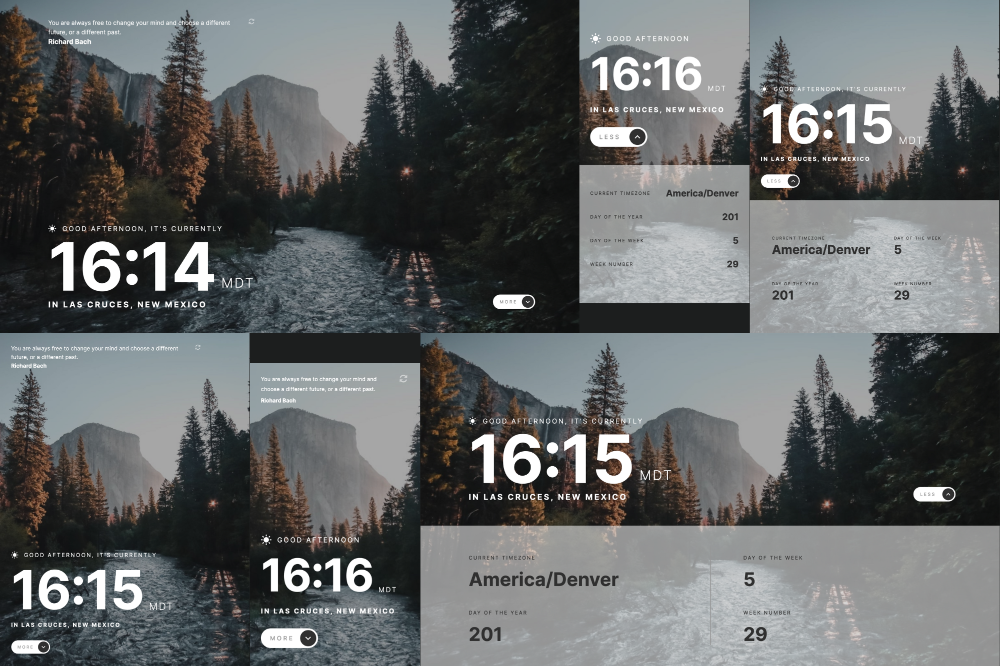

# Frontend Mentor - Clock app solution

This is a solution to the [Clock app challenge on Frontend Mentor](https://www.frontendmentor.io/challenges/clock-app-LMFaxFwrM). Frontend Mentor challenges help you improve your coding skills by building realistic projects. 

## Table of contents

- [Overview](#overview)
  - [The challenge](#the-challenge)
  - [Screenshot](#screenshot)
  - [Links](#links)
- [My process](#my-process)
  - [Built with](#built-with)
  - [What I learned](#what-i-learned)
  - [Continued development](#continued-development)
  - [Useful resources](#useful-resources)
- [Author](#author)

## Overview

### The challenge

Users should be able to:

- View the optimal layout for the site depending on their device's screen size
- See hover states for all interactive elements on the page
- View the current time and location information based on their IP address
- View additional information about the date and time in the expanded state
- Be shown the correct greeting and background image based on the time of day they're visiting the site
- Generate random programming quotes by clicking the refresh icon near the quote

### Screenshot

### Links

- Solution URL: [https://github.com/915fonzie/clock-app](https://github.com/915fonzie/clock-app)
- Live Site URL: [https://fonzies-clock-app.netlify.app/](https://fonzies-clock-app.netlify.app/)

## My process

### Built with

- Semantic HTML5 markup
- CSS custom properties
- SASS
- Flexbox
- CSS Grid
- Mobile-first workflow
- [React](https://reactjs.org/) - JS library
- [React-Query](https://tanstack.com/query/latest/docs/framework/react/overview) - React framework
- [Styled Components](https://styled-components.com/) - For styles

### What I learned

In this project I learned how to use React-Query for fetching data. I don't get the full benefit of it in this project but it was still something I had seen mention and realized it would be good to learn about and use it.

### Continued development

I definitely feel like I need to really continue my learning about animations and the limitations within CSS in regards to what can and cannot have animations affected to them.

### Useful resources

- [Geolocation API](https://docs.abstractapi.com/ip-geolocation) - I ended up using a different api to get location of user since this api has a higher limit for free users.

## Author

- Website - [Alfonso Pruneda-Suarez](https://www.fonziepruneda.com)
- Frontend Mentor - [@915fonzie](https://www.frontendmentor.io/profile/915fonzie)

